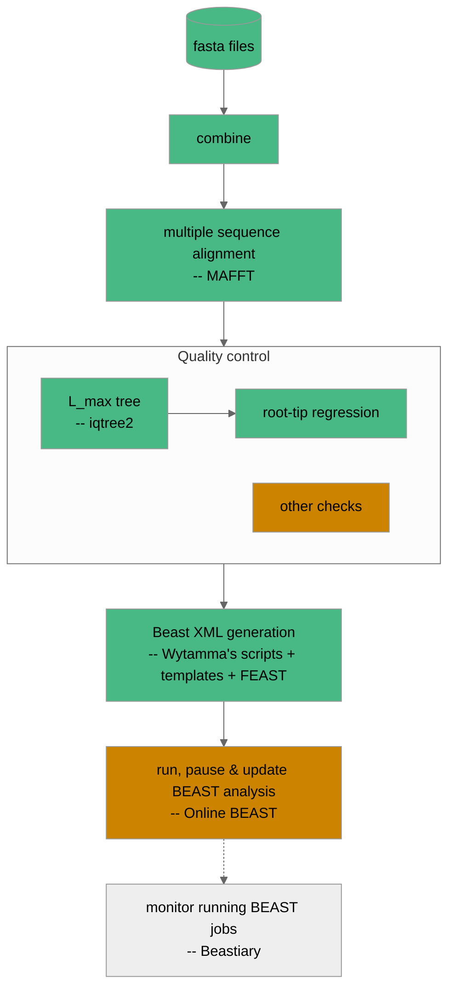

# Current workflow

[](https://pypi.org/project/mccoy/)
[](https://github.com/mccoy-devs/mccoy/actions/workflows/tests.yaml)
[](https://mccoy-devs.github.io/mccoy/)
[](https://results.pre-commit.ci/latest/github/smutch/mccoy/main)

This will be updated as pieces are developed and modified.



# Instructions

Ensure you have [mamba](https://github.com/conda-forge/miniforge) (conda will work too, but mamba is strongly preferred), and [poetry](https://python-poetry.org) installed.

## Step 1 - install the workflow

```bash
poetry install
```

To start using McCoy, you can either spawn a new shell with the McCoy Poetry environment enabled:

```bash
poetry shell
```

**or** you can replace every instance of `mccoy` in the commands below with `poetry run mccoy`.

The workflow is being developed such that all required software will be automatically installed for each step of the pipeline in self-contained conda environments. These environments will be cached and reused whenever possible (all handled internally by snakemake), but if you want to remove them then they can be found in `.snakemake`.

## Step 2 - Create a McCoy project

First begin by creating a new McCoy project (called `test` in this example):

```bash
mccoy create test --reference resources/reference.fasta --template resources/templates/CoV_CE_fixed_clock_template.xml
```

The `reference` and `template` options are required. At the moment we are distributing these reference and template files, however, once we reach v1.0, these will be removed and the useer will have to ensure they have appropriate reference and template files available.

The config for this project can be altered by editing the newly created file `test/config.yaml`.

## Step 3 - Run the project!

To run the newly created project:

```bash
mccoy run test --data resources/omicron_test-original.fasta
```

Again, the `data` option here is required. This command will create a new directory in `test/runs` with the workflow results and output.

## Step 4 - Add new data

Subsequent calls to `mccoy run` will result in a whole new run of the pipeline from start-to-finsh unless the `--inherit` or `--inherit-last` flags are used. See `mccoy run --help` for more information. Inheriting from a previous run will use the data and MCMC state as a starting point for the new data.

```bash
mccoy run test --data resources/omicron_test-extra.fasta --inherit-last
```

As well as directly altering a project's `config.yaml`, config variables can be overridden on the command line. e.g.:
```bash
mccoy run --data resources/omicron_test-original.fasta --config align='{mafft: ["--6merpair", "--addfragments"]}'
```

Any options passed to `mccoy run` that are not listed in `mccoy run --help` will be directly forwarded on to Snakemake. See `mccoy run --help-snakemake` for a list of all available options.
