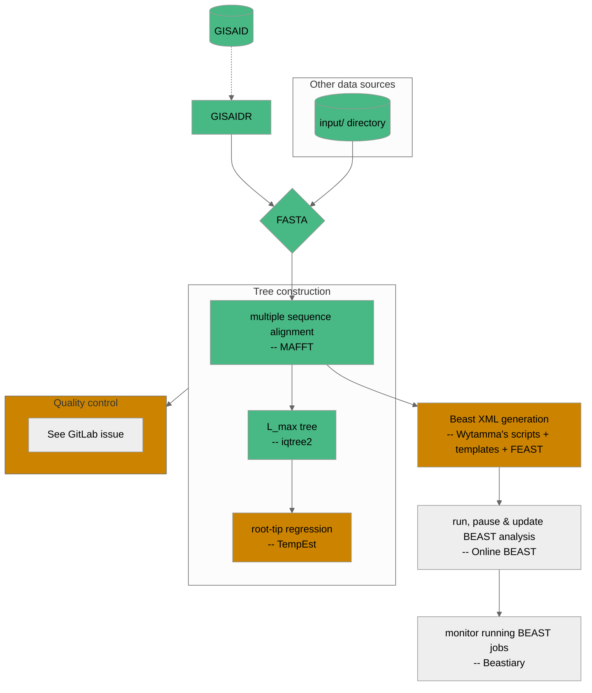

# Current workflow

[](https://gitlab.unimelb.edu.au/mdap-public/duchene-mdap-2022/-/commits/main)
[](https://mdap-public.pages.gitlab.unimelb.edu.au/duchene-mdap-2022/)


This will be updated as pieces are developed and modified.

**Legend**:
- <span style="color: #48b884">initial support in the workflow</span>
- <span style="color: #cc8400">in progress</span>



# Instructions

Ensure you have [mamba](https://github.com/conda-forge/miniforge) (conda will work too, but mamba is strongly preferred), and [poetry](https://python-poetry.org) installed.

## Step 1 - install the workflow

poetry install

## Step 2 - run the workflow

The workflow is being developed such that all required software will be automatically installed for each step of the pipeline in self-contained conda environments. These environments will be cached and reused whenever possible (all handled internally by snakemake), but if you want to remove them then they can be found in `.snakemake`.

First begin by creating a new Beastflow project (called `test` in this example):

```bash
poetry run beastflow create test --reference beastflow/resources/reference.fasta --template beastflow/resources/templates/CoV_CE_fixed_clock_template.xml
```

The config for this project can be altered by editing the newly created file `test/config.yaml`.

To run the newly created project:

```bash
poetry run beastflow run test --data beastflow/resources/omicron_test-original.fasta
```

This will create a new directory in `test/runs` with the workflow results and output. Subsequent calls to `poetry run beastflow run` will result in a whole new run of the pipeline from start-to-finsh unless the `--inherit` or `--inherit-last` flags are used. See `poetry run beastflow run --help` for more information.

As well as directly altering a project's `config.yaml`, config variables can be overridden on the command line. e.g.:
```bash
GISAIDR_USERNAME='_YOUR_USERNAME_' GISAIDR_PASSWORD='_YOUR_PASSWORD_' poetry run beasflow run --data beastflow/resources/omicron_test-original.fasta --config query.enabled=true
```

Any options passed to `poetry run beastflow run` that are not listed in `poetry run beastflow run --help` will be directly forwarded on to snakemake. See `poetry run beastflow run --help-snakemake` for a list of all available options.
