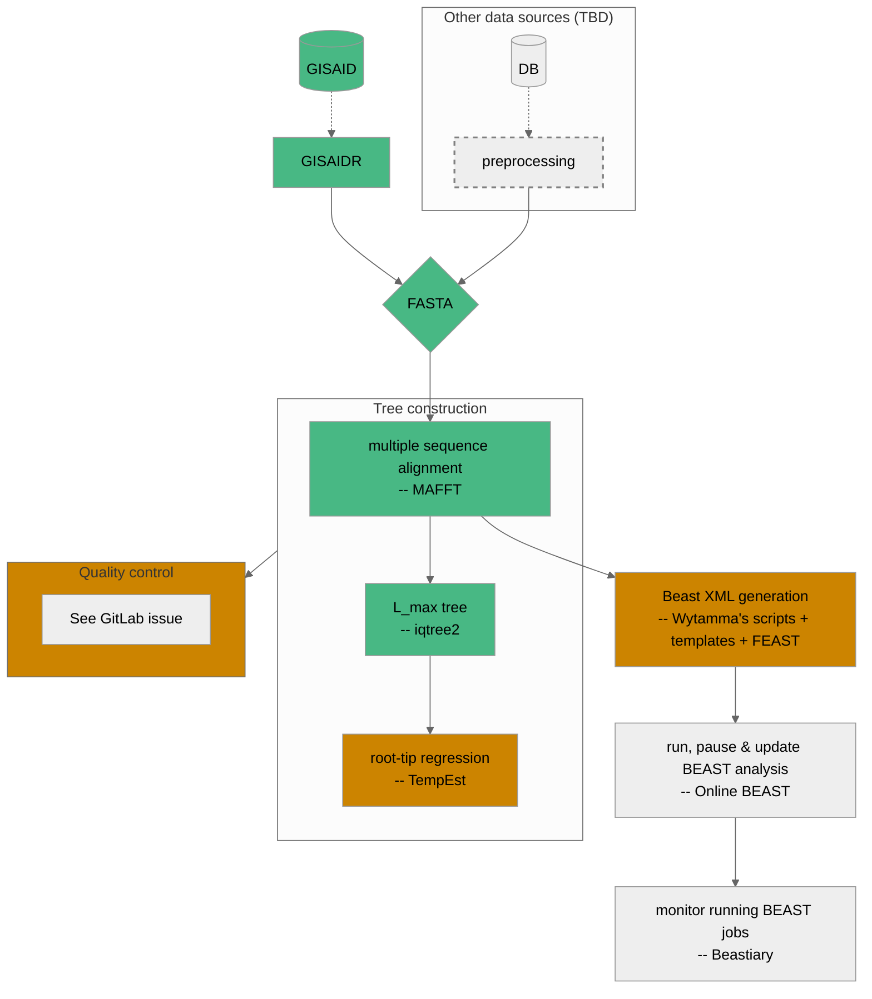

# Current workflow

This will be updated as pieces are developed and modified.

**Legend**:
- <span style="color: #48b884">initial support in the workflow</span>
- <span style="color: #cc8400">in progress</span>



# Instructions

Ensure you have [mamba](https://github.com/conda-forge/miniforge) installed (conda will work too, but mamba is strongly preferred).

## Step 1 - install snakemake

If you already have [snakemake](https://snakemake.readthedocs.io/en/stable/) and [just (a command runner)](https://github.com/casey/just) installed then go straight to step 2! Otherwise...

In the base directory of the repo, you can create a fresh conda environment with:

```bash
mamba env create -f environment.yml
```

This only needs to be done once.

You can then activate the environment using `conda activate duchene-mdap-2022`. This will need to be done for each fresh terminal you open if you want to use snakemake.

## Step 2 - run the workflow

The workflow is being developed such that all required software will be automatically installed for each step of the pipeline in self-contained conda environments. These environments will be cached and reused whenever possible (all handled internally by snakemake), but if you want to remove them then they can be found in `.snakemake`.

To run with the default parameters and configuration:

```bash
GISAIDR_USERNAME='_YOUR_USERNAME_' GISAIDR_PASSWORD='_YOUR_PASSWORD_' just local -c 1
```

The parameters passed to each tool in the workflow can be changed by making a copy of the default config file and modifying it appropriately:

```bash
cp config/config.yml custom-config.yml
# modify custom-config.yml as required
GISAIDR_USERNAME='_YOUR_USERNAME_' GISAIDR_PASSWORD='_YOUR_PASSWORD_' just local -c 1
```

On Spartan:

```bash
GISAIDR_USERNAME='_YOUR_USERNAME_' GISAIDR_PASSWORD='_YOUR_PASSWORD_' just spartan
```
